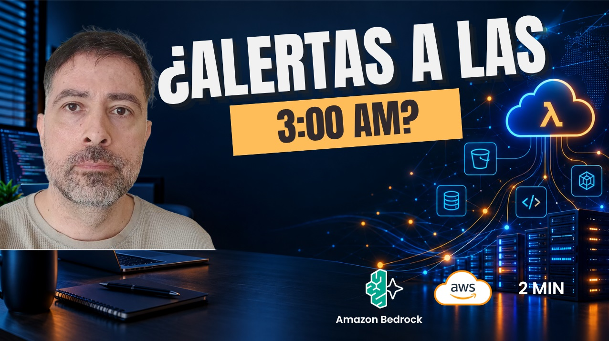
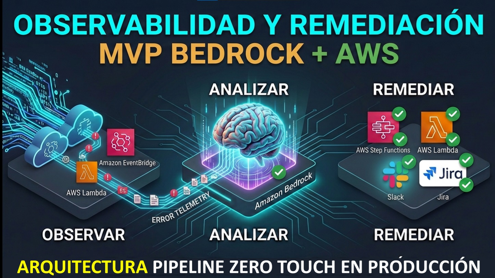
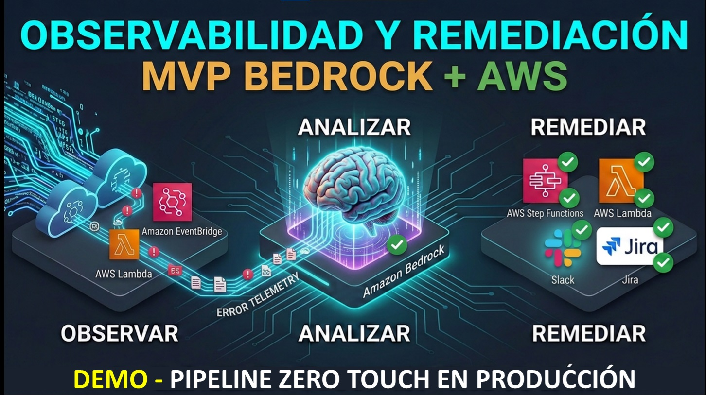

# aws-agentcore-ai-incident-remediation

> **Incident Observability & Automated Remediation with AI Agents (MVP)**\
> An experimental architecture built with Amazon Bedrock AgentCore and AWS that explores how AI agents can reason about production incidents and delegate safe remediation to a deterministic software layer.

---

## ⚡ The Core Principle

> **AI for reasoning and diagnosis. Deterministic software for execution and validation.**

The AI agent does **not** receive unrestricted access to AWS. It processes chaotic infrastructure data to isolate root causes and select an authorized playbook. The physical execution is restricted by a strict, allow-listed deterministic layer (AWS Lambda/Step Functions). If an anomaly is unknown, the system automatically shifts to assistance-mode.

---

## 🏗️ Architecture Overview

The pipeline is 100% event-driven and serverless:

```text
Production Services ──► CloudWatch Logs ──► Incident Filter (Lambda) ──► DynamoDB
                                                                             │
Slack / Jira ◄── Remediation Router ◄── Bedrock AgentCore ◄── EventBridge Scheduler
                       │ (MCP / Gateway)
          ┌────────────┴────────────┐
          ▼                         ▼
   AWS APIs (boto3)          Step Functions (Glue Recovery Workflow)
                                    │
                                    └──► Glue Crawler ──► Glue Job
```

### Supported Production Workloads (Validated MVP)
1. **Batch Workloads (AWS Glue Catalog Recovery):** Automatically identifies metadata arity mismatches (`INSERT_COLUMN_ARITY_MISMATCH`), orchestrates a Step Function to run the proper Glue Crawler, relanches the failed Glue Job, and validates the recovery state.
2. **Transactional Workloads (AWS Lambda):** Mitigates serverless operational friction (such as timeouts or Out-Of-Memory exceptions) by dynamically scaling resources under strict threshold limits.

---

## 🛡️ Key Features & Anti-Hype Design

* **Zero Intrusion:** Operates on top of your existing CloudWatch observability stack. No application code instrumentation or invasive third-party SDKs required.
* **Anti-Burst Token Protection:** The *Incident Filter Lambda* automatically detects multi-layer fault propagation and error bursts. It groups related events into a single compressed user prompt, avoiding infinite LLM token consumption loops.
* **Safe Manual Escalation:** When resource identification is ambiguous or outside the allow-list, the agent safely derives the incident to Jira/Slack. Instead of a blank alert, it attaches a step-by-step resolution plan with the exact **AWS CLI commands** ready for the SRE on call.

---


## 🚀 Live Demo & Deep Dive


Explore the project's design and implementation across different levels of technical depth. Click on the preview images below to watch the videos:

### 📺 1. Conceptual Trailer (2 min)
*A quick summary of the midnight operational pain, the business impact of downtime, and the core serverless architecture principles.*

[](https://www.linkedin.com/feed/update/urn:li:activity:7510595486907691010/)

---

### 🧠 2. Deep Dive: Architecture & Components (7:42 min)
*Detailed analysis of the event-driven infrastructure. Explanation of the Incident Filter logic, the AgentCore Gateway integration using the MCP protocol, and the deterministic execution layer.*

[](https://youtu.be/LPBV9P_NZe0)

---

### 💻 3. Full Technical Demo in Real-Time (11 min)
*End-to-end technical demonstration. Watch a simulated production failure via a metadata arity mismatch in an AWS Glue Job trigger a self-healing workflow through Step Functions, ending with deterministic validation and live alerts in Slack and Jira.*

[](https://youtu.be/IMOy127x_hc)


---

## 👥 Looking for Co-Founders & Collaborators (Join the Project!)

This project is transitioning from an experimental MVP into an **AIOps Startup/SaaS platform**. I am currently looking for passionate engineers and builders to join the initiative:

* **Backend / Cloud Security Engineers:** To scale the core API, optimize the AgentCore Gateway, and harden IAM boundaries.
* **SRE / DevOps / Platform Engineers:** To design new automated remediation templates (Kubernetes, ECS, RDS) and refine validation logic.
* **Growth / Business Partners:** To co-lead market validation and coordinate early pilot programs with scale-ups.

If you are excited about the intersection of Generative AI, infrastructure reliability, and open-source software, let's build the future of autonomous operations together! 

👉 **Open an Issue, submit a PR, or connect with me directly on [LinkedIn](https://www.linkedin.com/in/javier-ramirez-neira/).**

---

## 🛠️ Technology Stack

* **AI:** Amazon Bedrock AgentCore, Claude 3.5 Sonnet, MCP Tools.
* **AWS Compute & Infra:** Lambda, EventBridge Scheduler, Step Functions, DynamoDB, S3.
* **Data Engineering:** AWS Glue, Glue Data Catalog & Crawlers.
* **Integrations:** Jira API, Slack Webhooks.

---

## 📝 Disclaimer
This repository is an experimental MVP. Do not deploy in production environments without proper IAM guardrails, extensive testing, and organizational approval workflows.

Developed with 🧠 by **Javier Ramírez Neira**.
